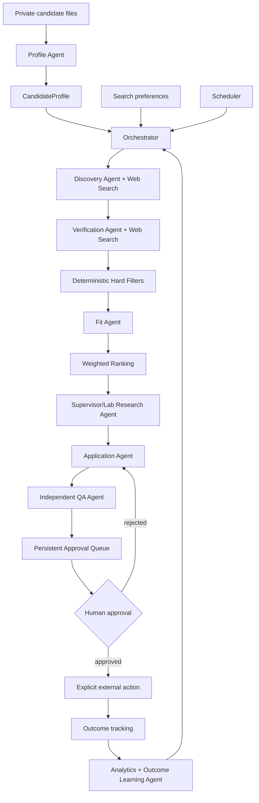

# Architecture

## Boundary between AI and deterministic code

### LLM/agent tasks

- extract a structured profile from unstructured evidence;
- discover opportunities;
- verify web evidence;
- assess semantic fit;
- research supervisors/labs;
- draft applications;
- independently review applications;
- prepare interviews;
- analyze outcome patterns cautiously.

### Deterministic code

- funding/location/deadline/application hard constraints;
- weighted-score arithmetic;
- workflow state transitions;
- database persistence;
- approval status;
- deadline calculations;
- artifact paths;
- SMTP dispatch preconditions.

This split is intentional: the model can reason about ambiguous academic fit, but it cannot decide that a self-funded position satisfies `fully_funded_only: true`.
